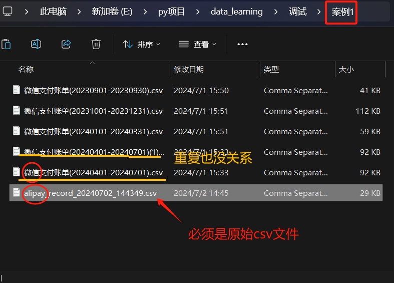
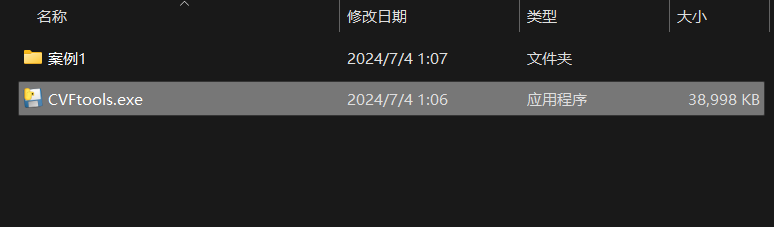
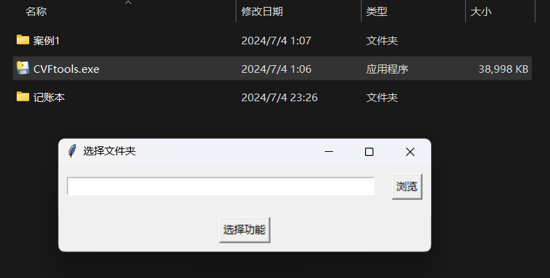
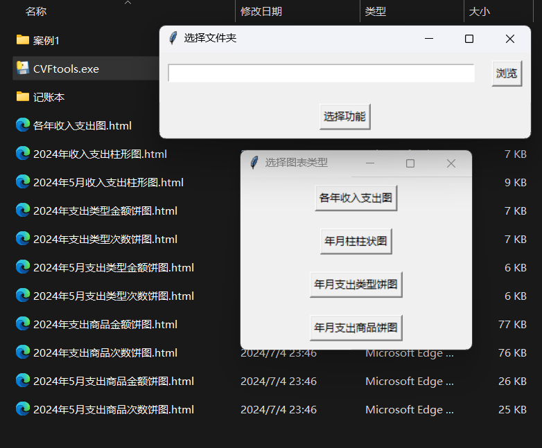
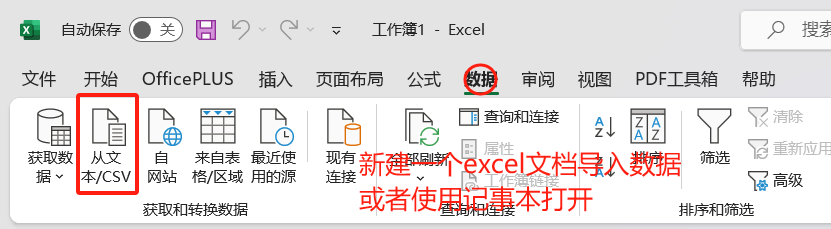

# 
<h1 style="color: #1E90FF; font-size: 36px;">使用指南</h1>

### **1.导入文件**
##### 注意当前1.0.0只能识别微信，支付宝原始csv文件
- 微信账单：打开微信主页面——点击【我】——点击【服务】——点击【钱包】——点击右上角【账单】——点击右上角【常见问题】——点击【下载账单】——选择所需账单用途（用于个人对账）——根据页面提示指引完成申请。
- 支付宝账单：打开支付宝——打开“我的”，进入“账单”——点击右上角——选择“开具交易流水证明”——选择“用于个人对账”，点击申请）——根据页面提示指引完成申请。
- 上传电脑，将csv文件放在同一文件夹下
  
### **2.执行程序**
这里建议将exe程序放进与存放csv文件的文件夹的同一路径下

##### 运行exe程序,选择仅存有原始csv文件的文件夹，会在该路径生成一个记账本，里面存有初清洗的数据(.csv)

记账本顾名思义用作记账，处理好的文件读取请往后看
##### 选择好文件夹后，接着可以点开 ***[选择功能]*** 生成可视化图表

<h1 style="color: red; font-size: 16px;">请用浏览器打开html，而且需要联网 绘图工具使用的是echarts，并且没有内置</h1>

### **3.记账本**
- 使用记事本打开
- 使用Excel导入
  
  